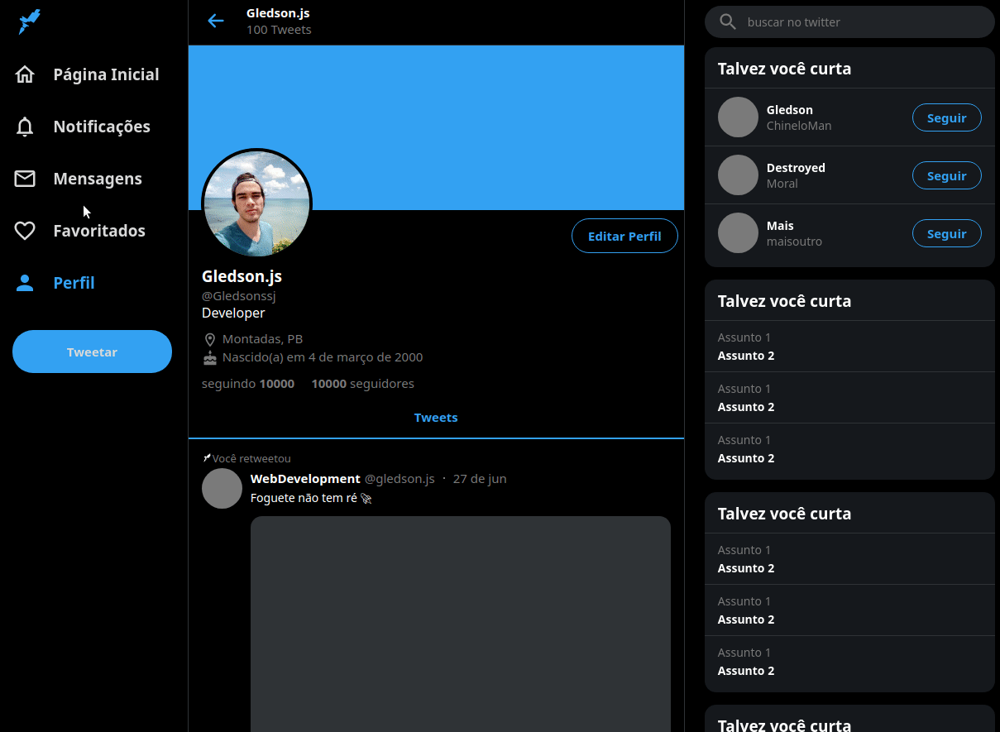

    
     

<h1 align="center">

TWITTER PROFILE PAGE IMPLEMENTATION

</h1>

<h1 align="center">

</h1>

## 📚 Description 
- This repository was created to implement a version of <a src="https://twitter.com/gledsonDev">twitter</a> profile page 07/26/2020

## ✨ Feature
* responsive page(mobile, tablet, desktop)
* navBar effect twitter
* theme black version

## 🚀 Getting started  
- git clone https://github.com/GledsonS831/twitter-resonsive-react
- yarn `use yarn command ouside clone-twitter because has dependencies`
- cd clone-twitter
- yarn
- yarn start

## ✅ Accepted Commits

- `:collision:` A new feature
- `:package:` A new package
- `:hammer:` Changes to the build process or auxiliary tools
- `:pencil2:` A code change that neither fixes a bug or adds a feature
- `:trophy:` A code change that improves performance
- `:wrench:` A bug fix
- `:beetle:` An unresolved bug
- `:x:` delete file
- `:back:` Revert to a commit
- `:book:` Documentation only changes

## 📝 Tests  
- There's not

## 🔒 License
MIT

---

	i love creating codes 💜

